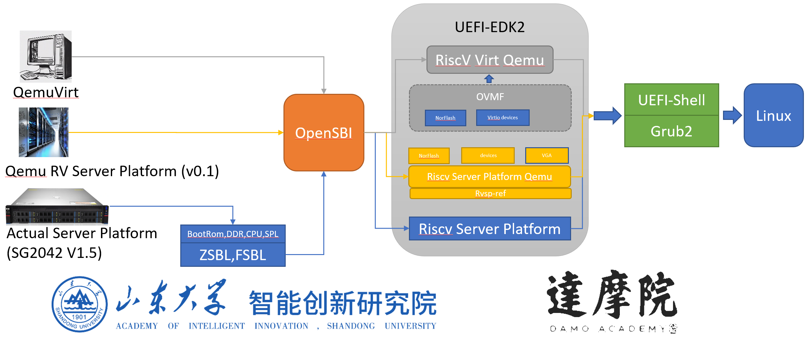

# rv-sp-test-mod

## Overview

Used for the rapid construction of standard Riscv-Server-Platform UEFI EDK2 firmware, running in a Qemu environment, to complete the RV BRS-I test.

The scripts include three components:
1. Build the standard RISC-V Server Platform.
2. Compile the RISC-V Linux image file.
3. Compile the RV-BRS test and conduct BRS-I standard testing (currently only includes the SCT portion).

## Introduction

## How To Build：
Download the rv-sp-test-mod repository enter this directory:  

        git clone https://github.com/AII-SDU/rv-sp-test-mod.git  
        cd rv-sp-test-mod

Run build_rvsp.sh，starting to build components you need：

        . build_rvsp.sh  

There are 8 choices in this script：

1) Clone edk2 and edk2-platform

2) Set environment variables

3) Compile tools (BaseTools)

4) Compile of specified platform firmware

5) Compile OpenSBI

6) Compile QEMU

7) Brs test on QEMU

8) Compile all components

You can choose components you need to compile.

Run rvsp_brs_test.sh, starting to build, package and run SCT test.  

        . rvsp_brs_test.sh

There are 4 choices in this script:

1) build SCT test

2) Package the SCT tests into a FAT file system.

3) Run SCT tests on QEMU.

4) Execute all

If everything goes well, you will find SCT package under rvsp-brs-test/RISCV64_SCT
and brs_live_image.img under rvsp-brs-test/output.

If you want to build linux image, then run rvsp_linux_img_build.sh

        . rvsp_linux_img_build.sh

There are 8 choices in this script, you can choose the things you need to build:

1) Clone All Repositories
   
2) Build Buildroot
   
3) Build GRUB
   
4) Build Linux Kernel
   
5) Prepare Boot Image
   
6) Build All
   
7) Clean Build Directories
   
8) Exit
   
If everything goes well, you can find linux_image.img under rvsp-linux-img/image_output